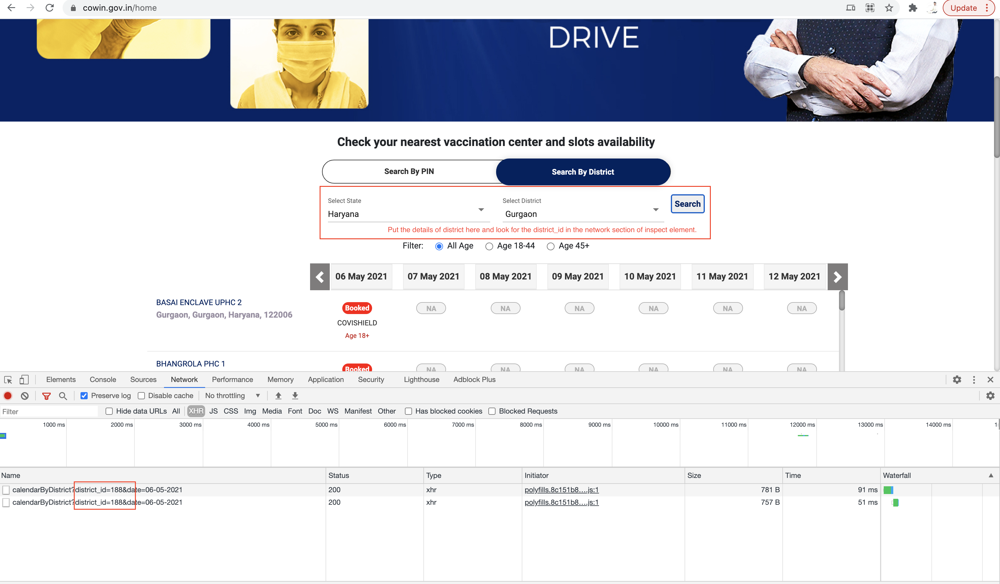

<!-- GETTING STARTED -->

### Prerequisites
1. Python3
2. Virtualenv
3. Find your district code from https://www.cowin.gov.in as shown below and put it in config.py file:


### Installation
* create virtualenv
  ```sh
  virtualenv cowin_env
  ```
* activate env
  ```sh
  source cowin_env/bin/python3
  ```

1. Create virtualenv
  ```sh
  virtualenv cowin_env
  ```
2. Activate env
  ```sh
  source cowin_env/bin/python3
  ```
3. Install pip packages
   ```sh
   pip3 install -r requirements.txt
   ```


<!-- USAGE EXAMPLES -->
## Usage

Run main.py
   ```sh
   python3 src/main.py
   ```
You will hear rooster alarm when the vaccine slots are available in your district.
